### Build and Monitor Apache Spark Applications (Spark v2.1)

([https://learn.mapr.com/series/sparkv2/dev-361-build-and-monitor-apache-spark-applications-spark-v21]) 

*Define the Spark Program Lifecycle*

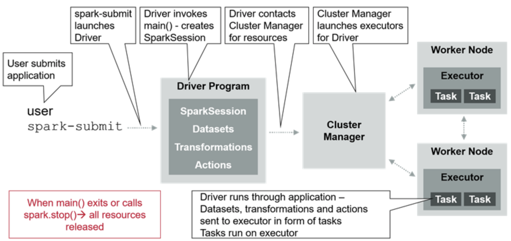

*Build a Standalone Application*

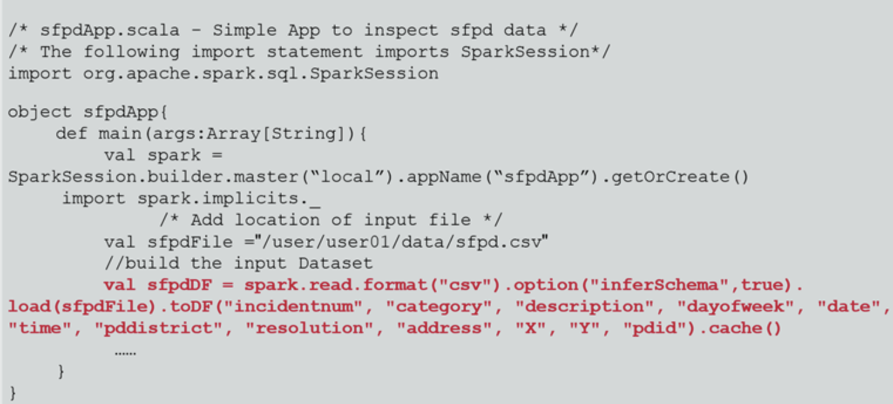

*Ways to Launch a Spark Application*

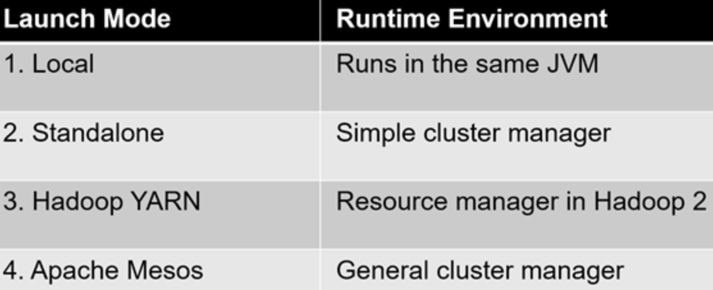

*Mode 1: Local*

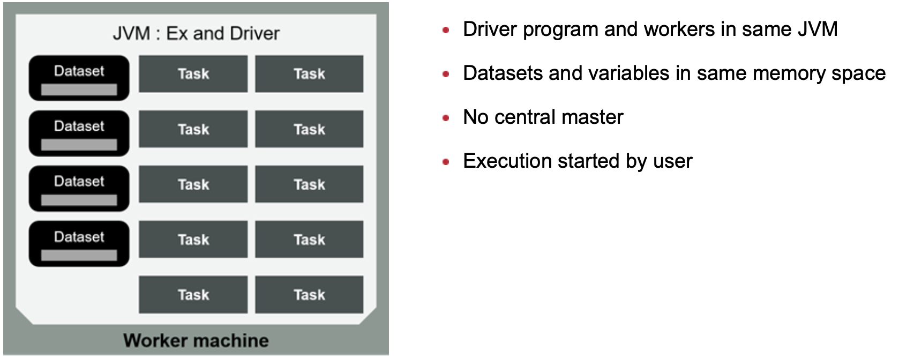

*Mode 2: Standalone*

* Simple standalone deploy mode
* Install by placing compiled version of Spark on each cluster node
* Can be used on multiple nodes

```java
import org.apache.spark.sql.SparkSession
val spark = SparkSession.builder.master("spark://<host_IP>:7077").appName("sfpdApp").getOrCreate()
```
Driver launched from worker process inside cluster
Asynchronous: can quit without waiting for result 
If using spark-submit → application automatically distributed to all worker nodes

| Cluster mode        | Client mode    |
| ------------- |-------------|
| Driver launched from worker process inside cluster      | Driver launches in the client process that submitted the job |
| Asynchronous: can quit without waiting for result       | Synchronous: must wait for result|
| If using spark-submit → application automatically distributed to all worker nodes | If using spark-submit → application automatically distributed to all worker nodes      |

*Mode 3: Hadoop YARN*

| Cluster mode        | Client mode    |
| ------------- |-------------|
| Driver launched in Application Master in cluster or worker      | Driver launches in the client process that submitted the job |
| Can quit without waiting for job results (async)       | Can quit without waiting for job results (async)|
| Suitable for production deployments | Useful for Spark interactive shell or debugging      |

*Mode 4: Apache Mesos Cluster Manager*

* Mesos Master replaces Spark Master as Cluster Manager
* Driver creates job and Mesos determines what machines handle what tasks
* Multiple frameworks can coexist on same cluster

* Coarse-grained Mode (Default)
  * Launches one task on each Mesos machine
  * No sharing between users 
  * Much lower startup overhead
* Dynamic Resources Allocation mode
  * Each spark task runs as a separate Mesos task
  * Benefits when enabled: 
    * Resources allocated dynamically for Spark tasks 
    * Scales up/down automatically based on running tasks
  
### Comparaison between Mesos and Yarn?

## Describe Logical and Physical Plans of Spark Execution

### Components of Spark Execution

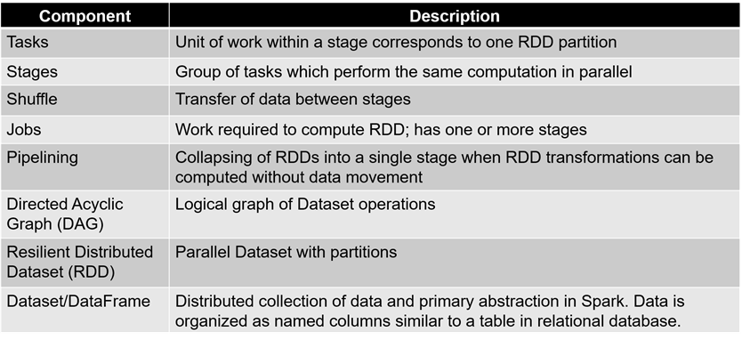

### Phases During Spark Execution 

| Phase 1| Phase 2| Phase 3  |
| -------------|-------------|-----|
| Create the Logical Plan: User code defines the DAG | Actions responsible for translating DAG into physical execution plan | Tasks scheduled and executed on cluster|

### Logical Plan Steps

#### Logical Plan Overview

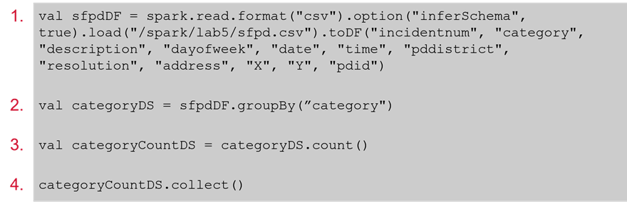

```java
val sfpdDf = spark.read
    .format("csv").option("inferSchema", true)
    .load("./sfpd.csv")
    .toDF("incidentnum", "category", ...)
```
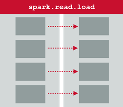

```java
val categoryDS = sfpdDF.groupBy("category")
```
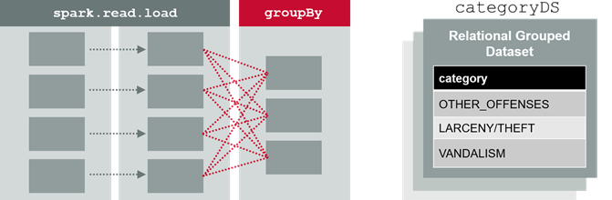

```java
val categoryCountDS = categoryDS.count()
```
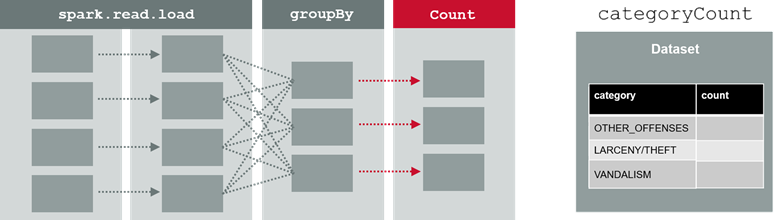

```java
categoryCountDS.collect()
```
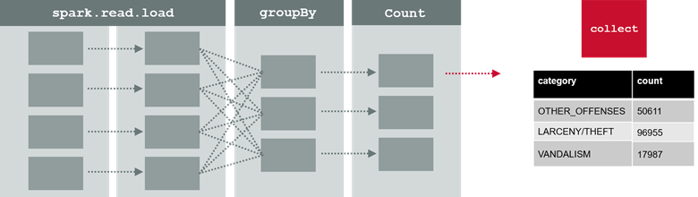

When an action is encountered, the DAG is translated into a physical plan.

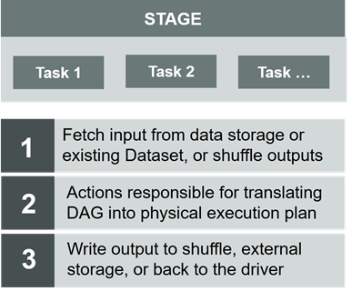